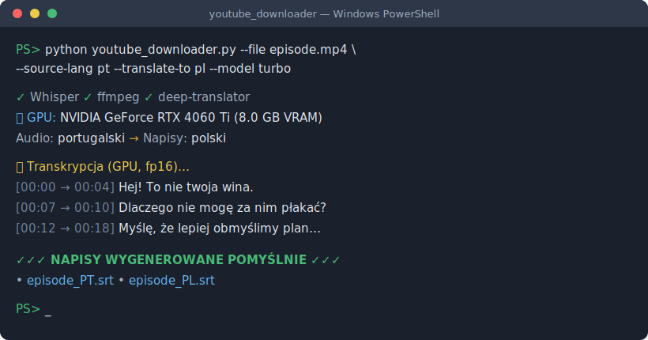

# 🎬 YouTube Downloader + AI Subtitles

> Download any YouTube video (or use a local file), generate subtitles with **OpenAI Whisper**, and **translate them into any language** — fully automated, GPU-accelerated, and resilient to errors.

<p align="center">
  <a href="https://github.com/msikorski-sketch/ytsubtran/actions/workflows/ci.yml"></a>
  
  
  
  
  
</p>

<p align="center">
  
</p>

---

## ✨ Why this tool?

Most "YouTube to subtitles" scripts break the moment YouTube changes something, mis-detect the spoken language, or produce garbled, looping text. This one is built to **just work**:

- 🛡️ **Self-healing downloads** — auto-installs/updates `yt-dlp`, tries multiple format strategies, resumes interrupted transfers, bypasses geo-blocks, and diagnoses failures in plain language.
- 🌐 **Smart language detection** — samples *several* points in the audio (not just the first 30 s), so an English intro on a dubbed video won't fool it.
- 🎯 **High-quality transcription** — anti-hallucination decoding (no more `"I'm sorry"` × 20 loops) and an optional context prompt for names & jargon.
- 🔁 **Built-in translation** — turn a Portuguese video into Polish subtitles in one command.
- ⚡ **GPU acceleration** — automatically uses your NVIDIA card (with CPU fallback if VRAM runs out).

## 🎥 See the difference

Real example — a Portuguese-dubbed video with an English intro:

**❌ Without language fix (wrong language detected from intro):**
```
We lost everything, that's it. This guy was able to make the biggest shit of all.
I'm sorry. I'm sorry. I'm sorry. I'm sorry. I'm sorry. I'm sorry...
```

**✅ With `--source-lang pt --model turbo` (correct):**
```
Hej! To nie twoja wina.
Dlaczego nie mogę za nim płakać?
Myślę, że lepiej obmyślimy plan powstrzymania Jaxa.
```

---

## 🚀 Quick start

```bash
# 1. Install (gets the `ytsubtran` command + all dependencies)
pip install .
# (also install ffmpeg and add it to PATH — see the full guide)

# 2. Download a video + Polish subtitles
ytsubtran "https://youtube.com/watch?v=VIDEO_ID" --subs
```

That's it. Subtitles (`.srt` + `.txt`) appear next to the downloaded file.

> Prefer not to install? You can always run the script directly:
> `python youtube_downloader.py "URL" --subs`

---

## 🧰 Features at a glance

| Capability | How |
|---|---|
| Download video (MP4) | `ytsubtran "URL"` |
| Download audio only (MP3) | `... --format mp3` |
| Generate subtitles | `... --subs` |
| Translate subtitles → Polish | `... --subs --source-lang es --translate-to pl` |
| Auto-detect spoken language | `... --source-lang auto` |
| Work on a local file (no download) | `--file "C:\videos\clip.mp4"` |
| Pick a Whisper model | `--model turbo` (or `large-v3`, `medium`, …) |
| Improve accuracy with context | `--prompt "Pomni, Ragatha, Jax, Caine"` |
| Age-restricted / "not a bot" videos | `--cookies-from-browser chrome` |
| Choose where files are saved | `--output-dir "C:\downloads"` |
| Also export WebVTT subtitles | `--vtt` |
| Burn subtitles into the video | `--burn` |
| Embed a toggleable subtitle track | `--embed` |

## 📦 Installation

You need **Python 3.9+** and **ffmpeg** on your PATH.

```bash
python -m venv .venv
# Windows:  .\.venv\Scripts\activate
# Linux/mac: source .venv/bin/activate

# Install the package (provides the `ytsubtran` command):
pip install .

# …or, if you just want the dependencies without installing the command:
pip install -r requirements.txt
```

**ffmpeg:** download from [gyan.dev](https://www.gyan.dev/ffmpeg/builds/) (Windows) or `sudo apt install ffmpeg` / `brew install ffmpeg`.

> 📖 **Full step-by-step Windows guide (Polish):** [`YouTube_Downloader_Instrukcja_Windows.html`](YouTube_Downloader_Instrukcja_Windows.html)

## ⚡ GPU acceleration (NVIDIA)

By default PyTorch runs on CPU, which is slow for big models. With an NVIDIA card:

```bash
pip uninstall -y torch
pip install torch --index-url https://download.pytorch.org/whl/cu126
python -c "import torch; print(torch.cuda.is_available())"   # should print True
```

The script auto-detects the GPU, reports its name and VRAM, transcribes with `fp16`, and falls back to CPU if it runs out of memory. Match the `cu1XX` number to your driver (check `nvidia-smi`).

## 🧠 Whisper models

| Model | RAM/VRAM | Speed | Quality | Best for |
|---|---|---|---|---|
| `tiny` | ~1 GB | fastest | low | quick tests |
| `base` | ~1 GB | fast | fair | simple speech |
| `small` | ~2 GB | medium | good | clearer transcripts |
| **`turbo`** ⭐ | ~6 GB | fast | very good | **best all-round, esp. on 8 GB GPUs** |
| `medium` | ~5 GB | slow | very good | real videos without a strong GPU |
| `large-v3` | ~10 GB | slowest | best | maximum accuracy |

Any name Whisper supports works — newer models will too, no code changes needed.

## 💡 Getting the best quality

1. **Set the correct language** (`--source-lang`) — the #1 cause of bad subtitles is wrong language detection on dubbed content.
2. **Use a bigger model** — `turbo` or `large-v3`.
3. **Add `--prompt`** with character names / terminology (in the spoken language).
4. **Use a GPU** to make big models practical.

## 📄 Output

Files are written next to the source, suffixed with the language code. When translating, **both** versions are saved:

```
video.mp4
video_PT.srt   video_PT.txt   # original transcription
video_PL.srt   video_PL.txt   # translated subtitles
```

Load the `.srt` in VLC (Subtitles → Add Subtitle File) or keep it next to the video.

## 🩹 Troubleshooting

| Problem | Fix |
|---|---|
| `HTTP 403` / `Unable to extract` | Script auto-updates `yt-dlp` and retries. Else: `pip install -U yt-dlp` |
| "Sign in to confirm your age / not a bot" | `python -m yt_dlp --cookies-from-browser chrome "URL"` |
| `HTTP 429 Too Many Requests` | Wait a few minutes / switch network or VPN |
| Garbled or looping subtitles | Set `--source-lang` explicitly; use `--model turbo`; add `--prompt` |
| CUDA out of memory | Use `--model turbo`/`medium`; close other GPU apps |
| Transcription very slow | Install CUDA PyTorch, or use a smaller model |

## 📚 How it works

Want to understand the internals — or rebuild this from scratch? The
[**technical guide**](docs/HOW_IT_WORKS.md) explains every design decision: the
download fallback engine, robust language detection, anti-hallucination Whisper
parameters, GPU handling, the SRT format, translation, and a step-by-step build
order.

## 🤝 Contributing

Issues and pull requests are welcome! See [CONTRIBUTING.md](CONTRIBUTING.md).

## 📜 License

[MIT](LICENSE) — free to use, modify, and share.

## ⚖️ Disclaimer

For personal use. Respect YouTube's Terms of Service and the copyright of the content you download.

---

<p align="center"><sub>Built with ❤️ using <a href="https://github.com/openai/whisper">OpenAI Whisper</a> and <a href="https://github.com/yt-dlp/yt-dlp">yt-dlp</a>.</sub></p>
